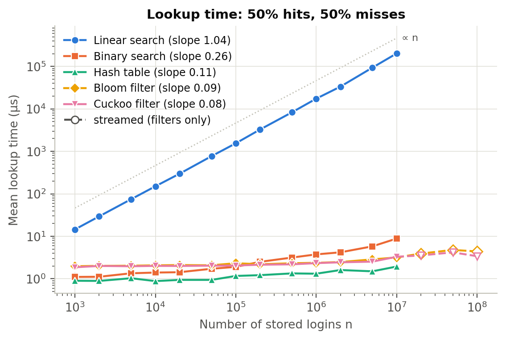
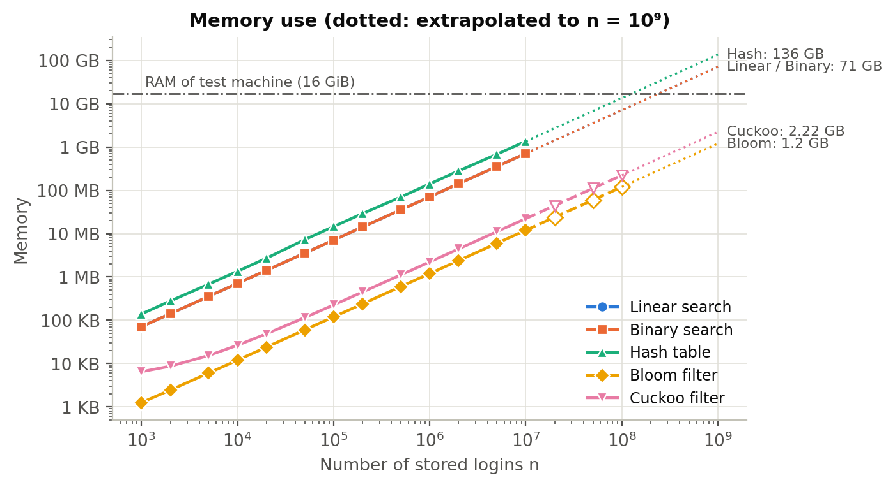

# Login Checker — COSC 520 Assignment 1

How fast can we answer *"is this username already taken?"* for millions of
users? This project implements five set-membership data structures from
scratch in Python, analyses their time and space complexity, and benchmarks
them on a synthetic dataset of login names.

| Structure | Module | Answer |
|---|---|---|
| Linear search over a list | `login_checker/linear_search.py` | exact |
| Binary search over a sorted array | `login_checker/binary_search.py` | exact |
| Hash table (separate chaining) | `login_checker/hash_table.py` | exact |
| Bloom filter | `login_checker/bloom_filter.py` | probabilistic: false positives, never false negatives |
| Cuckoo filter | `login_checker/cuckoo_filter.py` | probabilistic: false positives, never false negatives |

All five are implemented by hand. No library data structures are used: no
`dict`/`set` as the hash table, no `bisect`, and no Bloom/cuckoo packages. The
only library primitive is the BLAKE2b hash *function* from Python's standard
`hashlib`.

## Repository layout

```
.
├── login_checker/          # the library
│   ├── base.py             #   LoginChecker: interface shared by all five structures
│   ├── linear_search.py    #   LinearSearchChecker
│   ├── binary_search.py    #   BinarySearchChecker
│   ├── hash_table.py       #   HashTable (separate chaining, doubling at load 0.75)
│   ├── bloom_filter.py     #   BloomFilter (bit array, double hashing)
│   ├── cuckoo_filter.py    #   CuckooFilter (4-slot buckets, fingerprints, victim stash)
│   ├── hashing.py          #   BLAKE2b-based hash helpers (hash64, hash_pair, mix64)
│   ├── dataset.py          #   synthetic login generator, query mix, file I/O
│   └── experiment.py       #   shared timing helpers and table formatting
├── demo.py                 # live comparison of the five structures
├── scripts/
│   ├── generate_dataset.py # CLI: writes data/*.txt.gz and data/manifest.json
│   ├── run_benchmarks.py   # CLI: measures all five structures -> results/*.csv
│   └── plot_results.py     # CLI: figures, fitted slopes and summary tables
├── results/                # benchmark CSVs, figures/, summary.md (committed)
├── tests/                  # pytest suite (114 tests, about 2 s)
├── data/                   # dataset folder (large files downloaded or generated)
├── report/                 # ACM-format LaTeX report (main.tex, references.bib, figures/)
├── docs/
│   └── theory.md           # complexity analysis, formulas, references
├── requirements.txt        # pinned dependencies
└── pyproject.toml          # pytest configuration
```

## Setup

Requires **Python 3.10 or newer**. Run the commands from the repository root.

**Windows (PowerShell)**
```powershell
py -3.10 -m venv .venv
.venv\Scripts\Activate.ps1
pip install -r requirements.txt
```

**macOS / Linux**
```bash
python3 -m venv .venv
source .venv/bin/activate
pip install -r requirements.txt
```

No installation of the package itself is needed; every command is run from
the repository root.

## Demo

```bash
python demo.py                              # 100,000 logins, built-in examples (~2 s)
python demo.py --n 1000000                  # a bigger dataset (~15 s)
python demo.py --check alice fnaf0000001    # check your own logins
python demo.py --interactive                # type logins to sign up
```

The demo reads logins from `data/logins_10000000.txt.gz` when the file exists
and otherwise generates the same logins in memory. It then does four things:

1. builds all five structures and compares build time, memory, lookup time and false-positive rate;
2. checks example logins, including a real false positive found for each filter;
3. runs the sign-up flow (`register` accepts a free name once and rejects the repeat);
4. deletes an account, showing that the hash table and cuckoo filter can remove a login but a Bloom filter cannot.

Example output (Intel i7-11800H, Python 3.10):

```
1. Building the five structures
Structure      Build (s)  Memory (MB)  Bytes/login  Lookup (us)  False positives
-------------  ---------  -----------  -----------  -----------  ---------------
Linear search  0.00       7.10         71.0         1,406.51     none (exact)
Binary search  0.02       7.10         71.0         2.08         none (exact)
Hash table     0.34       14.55        145.5        1.16         none (exact)
Bloom filter   0.28       0.12         1.2          2.04         1.03%
Cuckoo filter  0.22       0.23         2.3          2.13         0.72%

2. Is this login taken?
Login               Linear search  Binary search  Hash table  Bloom filter  Cuckoo filter  Note
------------------  -------------  -------------  ----------  ------------  -------------  ----------------------------------------------
'ahftrxck0000000'   taken          taken          taken       taken         taken          stored
'sdmri000000'       free           free           free        free          free           never registered
'tasoxbahzi00002j'  free           free           free        taken         free           never registered: Bloom filter false positive
'zfapi00001r'       free           free           free        free          taken          never registered: Cuckoo filter false positive
```

## Benchmarks

```bash
python -m scripts.run_benchmarks --quick   # setup check: n up to 100k, ~25 s -> results/quick/
python -m scripts.plot_results --results results/quick

python -m scripts.run_benchmarks           # full run: ~1 hour -> results/
python -m scripts.plot_results
```

The benchmark runs three experiments:

| Experiment | Structures | Sizes | Measured |
|---|---|---|---|
| Stored | all five | n = 1,000 … 10,000,000 (1-2-5 steps) | median of 3 builds: build time, lookup time for hits and misses, memory, FP rate |
| Streamed | Bloom, cuckoo | n = 20M, 50M, 100M | the filters never store logins, so logins are generated in 1M chunks and discarded |
| Trade-off | Bloom, cuckoo | n = 1,000,000, FP targets 0.1% … 10% | bits per login vs. measured FP rate |

Each lookup measurement uses 20,000 queries (half stored logins, half
never-registered ones). Linear search is capped at 200 million scanned elements
per measurement, so it gets fewer queries at large n. Timings pause the garbage
collector, as `timeit` does. Memory is counted with `sys.getsizeof` over every
container and stored string.

### Results

Full run on an Intel i7-11800H (16 GiB RAM, Windows 11, Python 3.10.2), taking
59 minutes. The raw data is in [results/benchmark.csv](results/benchmark.csv),
all tables are in [results/summary.md](results/summary.md), and the figures are
in [results/figures/](results/figures/) as PNG and PDF.



| At n = 10,000,000 | Build (s) | Lookup (µs) | Hit / miss (µs) | Bytes per login | FP rate | Lookup slope |
|---|---|---|---|---|---|---|
| Linear search | 0.09 | 201,725 | 104,671 / 298,779 | 71.0 | 0 | 1.04 |
| Binary search | 10.5 | 8.83 | 8.08 / 9.58 | 71.0 | 0 | 0.26 |
| Hash table | 47.9 | 1.94 | 1.82 / 2.06 | 136.0 | 0 | 0.11 |
| Bloom filter | 49.4 | 3.18 | 4.09 / 2.27 | 1.2 | 1.04% | 0.09 |
| Cuckoo filter | 35.8 | 3.30 | 2.46 / 4.14 | 2.2 | 0.73% | 0.08 |

"Lookup slope" is the exponent fitted on log-log axes for n ≥ 10⁴: 1 means
linear growth and 0 means constant time.

- **Linear search is O(n).** Its slope is 1.04, and one lookup takes 0.2 s at 10 million logins.
- **Hash table, Bloom and cuckoo lookups are essentially constant.** Their slopes are 0.08–0.11 from 10³ to 10⁷, and the filters stay at 3.4–4.4 µs up to 10⁸. The small positive slope comes from CPU cache misses as the tables grow, not from more work per lookup.
- **Binary search makes ⌈log₂(n+1)⌉ comparisons**, but each comparison gets 3.7× slower once the data outgrows the 24 MB L3 cache ([figure](results/figures/binary_search_log.png)).
- **Memory decides what reaches n = 10⁹.** The exact structures need 71–136 bytes per login, i.e. 71–136 GB at 10⁹, far beyond 16 GiB. The Bloom filter needs 1.2 bytes per login (1.2 GB at 10⁹). The cuckoo filter needs 2.2 bytes per login as stored in Python, or about 1.4 GB at 10⁹ with 10-bit packing ([figure](results/figures/memory.png)).
- **False-positive rates match theory at every size up to 10⁸.** Bloom: 0.95–1.04% against the 1.00% formula. Cuckoo: 0.65–0.75% against 0.70% expected and a 0.78% bound ([figure](results/figures/false_positive_rate.png)).
- **Hits and misses behave differently in the two filters.** Bloom misses are faster than hits because the lookup stops at the first zero bit. Cuckoo misses are slower than hits because both buckets must be checked.



## Running the tests

```bash
python -m pytest
```

The suite runs in about two seconds and needs no dataset files.

| File | What it checks |
|---|---|
| `tests/test_common.py` | the contract every structure must satisfy, run once per structure: no false negatives, `register`, special logins (empty, Unicode, 10,000 characters), exact structures never wrong, filters' FP rate near target, filters far smaller than exact structures |
| `tests/test_binary_search.py` | lower-bound positions, boundaries, sortedness after single and bulk inserts |
| `tests/test_hash_table.py` | power-of-two capacity, resizing, short chains, duplicates, removal, worst case with every login in one chain |
| `tests/test_bloom_filter.py` | optimal `m` and `k` against hand-computed values, measured vs. theoretical FP rate, overfilling, memory |
| `tests/test_cuckoo_filter.py` | `f` formula, table sizing, alternate bucket is an involution, FP bound, removal, full-filter behaviour and victim stash, duplicate limit |
| `tests/test_hashing.py` | determinism, agreement with BLAKE2b, 64-bit range, even spread |
| `tests/test_dataset.py` | uniqueness, format, seeding, prefix property, absent logins never collide, query mix, file round trips, the generator script |
| `tests/test_experiment.py` | timing helpers, table formatting, and an end-to-end run of `demo.py` |

## Usage

Every structure implements the same `LoginChecker` interface:

```python
from login_checker import BloomFilter, HashTable

checker = BloomFilter(capacity=1_000_000, fp_rate=0.01)
checker.register("alice")   # True: the name was free and is now taken
checker.register("alice")   # False: already taken
"bob" in checker            # False: definitely free

table = HashTable()         # exact structures also support removal
table.register("alice")     # True
table.remove("alice")       # True
```

| Method | Meaning |
|---|---|
| `add(login)` | record a login as taken |
| `contains(login)` / `login in checker` | is the login (probably) taken? |
| `register(login)` | check, then add if free; returns whether it succeeded |
| `add_all(logins)` | bulk load |
| `memory_bytes()`, `len(checker)` | size information |
| `remove(login)` | `HashTable` and `CuckooFilter` only (a Bloom filter cannot delete) |

## Dataset

10 million synthetic, guaranteed-unique logins plus 100,000 guaranteed-absent
logins for miss queries.

- **Download:** https://github.com/ahmedelgazwy/Advanced_DS_assignment_1/releases/tag/dataset-v1. Put the files in `data/`.
- **Or regenerate** byte-identical files (about 40 s): `python -m scripts.generate_dataset`
- **Or a smaller one:** `python -m scripts.generate_dataset --n 100000`

The format and guarantees are described in [data/README.md](data/README.md).

## Report

The report is in [report/](report/): `main.tex` in the ACM Small format, with
its bibliography and figures. [report/README.md](report/README.md) explains how
to compile it on Overleaf.

## Theory

The time and space complexity of each structure, the Bloom and cuckoo filter
false-positive formulas, and the parameter choices are in
[docs/theory.md](docs/theory.md).

## AI usage

This project was developed with the help of an AI coding assistant (Claude
Code, Anthropic), as allowed by the course policy with disclosure. The
assistant helped draft the plan and generated the code, tests and
documentation. The author directed the work phase by phase and reviewed each
phase before the next one started. Every file produced with AI assistance
carries the line `AI-assisted: generated with Claude Code` in its header.
